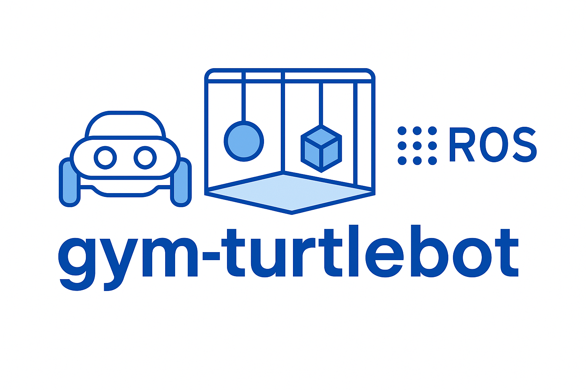

<p align="center">
  
</p>

<h1 align="center">gym-turtlebot</h1>

<p align="center">
  A custom Gymnasium environment to get started with deep reinforcement learning (DRL) using ROS 2 and Gazebo.
</p>

<p align="center">
  <a href="https://www.apache.org/licenses/LICENSE-2.0">
    
  </a>
  <a href="https://github.com/anurye/gym-turtlebot/actions/workflows/ros.yaml">
    
  </a>
  <a href="https://docs.ros.org/en/jazzy/Installation.html">
    
  </a>
  <a href="https://gazebosim.org/docs/harmonic/ros_installation/">
    
  </a>
  <a href="https://www.python.org/downloads/">
    
  </a>
</p>

---

## Overview

`gym-turtlebot` provides a lightweight, modular environment for training reinforcement learning agents using a TurtleBot4 robot simulated in **ROS 2 Jazzy** and **Gazebo Harmonic**. It wraps the simulation in a standard [Gymnasium](https://gymnasium.farama.org/) interface to enable fast prototyping and evaluation of DRL algorithms in realistic robotics environment.

---

## Features

- ROS 2–based robot control integration  
- Customizable Gazebo simulation worlds  
- Gymnasium-compliant API  
- Supports headless and visual simulation  
- Easily extendable for custom robots

---

## Installation

### Using Docker
#### Prerequisites
- [Docker](https://docs.docker.com/engine/install/)
- [VSCode](https://code.visualstudio.com/) with [remote containers plugin](https://marketplace.visualstudio.com/items?itemName=ms-vscode-remote.remote-containers) installed.

> [!NOTE]
> The Docker setup is adapted from [vscode_ros2_workspace](https://github.com/athackst/vscode_ros2_workspace).
> 
> Refer to the [template repository](https://github.com/athackst/vscode_ros2_workspace) for more detailed instructions on how to use VS-code and docker for ROS.

#### Steps
1. Build 
```bash
# Clone the repo into your ROS 2 workspace
mkdir ~/ros2_ws
cd ~/ros2_ws
git clone https://github.com/anurye/gym-turtlebot.git
```

```bash
# Install dependencies
cd ~/ros2_ws
./setup.sh
```

```bash
# Build the workspace and source the setup script
cd ~/ros2_ws
./build.sh
source install/local_setup.bash
```

2. Simulation
```bash
cd ~/ros2_ws
ros2 launch tb4_gz_sim simulation.launch.py
```

3. Deep reinforcement training example
> [!IMPORTANT]
> Gazebo Sim does not support model reset at the moment. To work around this limitation, we reset both the robot's odometry and its pose by using:
> 1. The `SetPose` service from the [robot localization](https://github.com/cra-ros-pkg/robot_localization) package  to reinitialize odometry, and
> 2. The `SetEntityPose` service from the [ros_gz_interfaces](https://github.com/gazebosim/ros_gz/tree/ros2/ros_gz_interfaces) package to reposition entities in Gazebo.

```bash
python3 src/tb4_drl_navigation/tb4_drl_navigation/examples/sac.py train
```

### Local Setup

#### Prerequisites
- [Ubuntu 24.04](https://ubuntu.com/download/desktop)
- [ROS 2 Jazzy](https://docs.ros.org/en/jazzy/Installation.html) 
- [Gazebo Harmonic](https://gazebosim.org/docs/harmonic/ros_installation/)

#### Steps
The steps are the same as [above](#steps).
