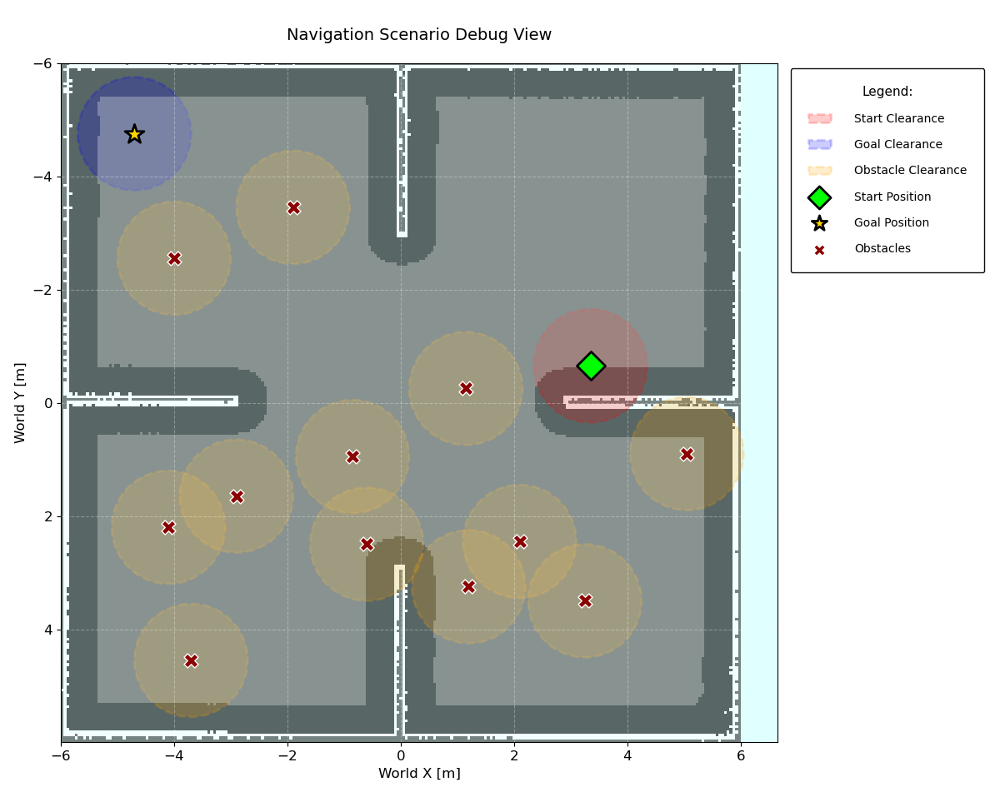
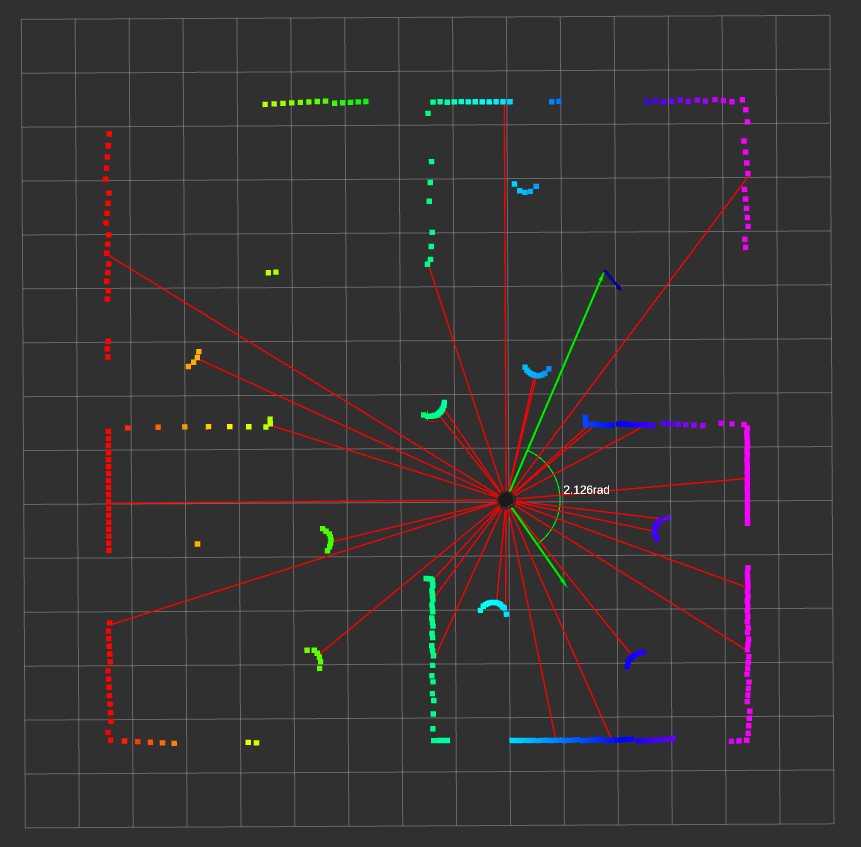

# Tutorial
In this document you will find how you can setup your own world and robot to be used with this environment.


## Usage with custom world
If you do not want to shuffle the obstacles at reset, the only thing you need to do is update the world name used in the launch argument declaration in `simulation.launch.py` or pass the `sdf` file during launch as:
```bash
ros2 launch tb4_gz_sim simulation.launch.py world:=src/turtlebot4/tb4_gz_sim/worlds/<world_name>.sdf 
```

However, if you do prefer shuffling obstacles during reset for better generalization, you will need the map of your world.

> [!NOTE]
> The map should not contain the obstacles that you want to be shuffled.

Then when making the environment be sure to specify:
- world_name
- map_path
- yaml_path (this is the path to the map metadata)
- obstacle_prefix: we need this to query the list of obstacles from gazebo
- obstacle_clearance: distance between obstacles, should ideally be greater than the max obstacle radius

You can directly use `scenario_generator.py` to see if start/goal pairs and obstacles are being assigned properly.
```bash
python3 src/tb4_drl_navigation/tb4_drl_navigation/envs/diffdrive/scenario_generator.py -m path/to/<map>.pgm -y path/to/<map>.yaml
```
You should get something like:
<p align="center">
  
</p>


## Usage with custom robot.
The environment is originally build for a differential drive robot. If your robot is a differential drive robot then you can use it directly provided the topics used are `scan`, `odom`, `cmd_vel`. Otherwise you will have to make the necessary adjustments in `ros_gz.py` and in `robot_localization` EKF node config file, `ekf.yaml`.

Furthermore, be sure to specify the following parameters when making the environment:
- robot_name: this is use to set the pose of the robot during reset.
- robot_radius: Used for creating buffer around walls.


You also have the option to specify the following parameters.
- num_bins: by default we create 30 bins and take the shortest range from each bin and its 
respective orientation to represent the environment state. It can be as high as `len(ranges)`
- min_separation: used to specify the minimum separation distance between the stat and goal pose.
- goal_sampling_bias: this parameter allows you to provide distance bias when choosing goal pose. The
  default is `uniform`, but you can specify `far` or `close` as well.
- goal_threshold: threshold distance to conclude goal is reached
- collision_threshold: threshold distance to conclude collision is encountered
- time_delta: time in `sec` between observations.
- shuffle_on_reset: whether to shuffle obstacles on reset or not.

To check that everthing is working with your custom robot, try reseting the environment in `debug` mode as follows.
```bash
python3 src/tb4_drl_navigation/tb4_drl_navigation/envs/diffdrive/turtlebot4.py
```

You should see something like the following in rviz:
<p align="center">
  
</p>

# Limitations
> [!WARNING]
> Currently this environment is not vectorized.